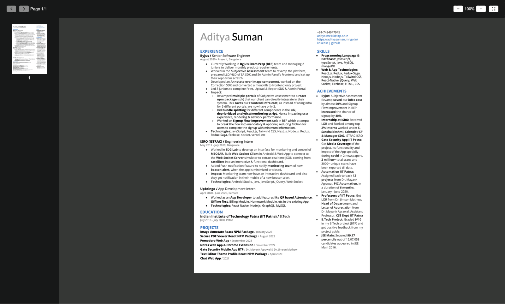

# react-image-annotate-mngo

This library is available at [react-secure-pdf-viewer-mngo](https://www.npmjs.com/package/react-secure-pdf-viewer-mngo)

## Demo

[pdf.mngo.in](https://pdf.mngo.in)

## Brief:

A JavaScript React Library (npm package) to open any pdf (password protected or non-protected both) having thumbnail, jump to page, zoom features and security features like

✅ block right click
✅ disable user select
✅ block download
✅ block getting pdf url by inspecting elements
✅ block printing of the page/pdf
❌ screenshot
❌ screen recording
✅ open pdf in pdf viewer using the given password programmatically

## Screenshots:

## Usage

    <MNgoSecurePDFViewer
        styles={{ [key: string]: string }}
        pdfUrl={string}
        pdfPassword={string}
        compHeight={string}
    />

`props example`

1.  `styles` different classes to override different style of elements

               {
                  pdfComponentClassName: string
                  toolbarClassName: string
                  toolbarSegClassName: string
                  toolBarBtnClassName: string
                  pdfViewerClassName: string
                  pdfPageClassName: string
                  pdfThumbContainerClassName: string
                  pdfThumbPageClassName: string
               }

2.  `pdfUrl` url (internal or extneral) of the pdf to open
3.  `pdfPassword` password of the pdf if, the pdf is password protected
4.  `compHeight` height of the component

## Installation

1. npm install
2. npm start

## Available Scripts

In the project directory, you can run

### `npm start`

Runs the app in the development mode
Open [http://localhost:5173](http://localhost:5173) to view it in the browser.

### `npm run lib-build`

it is for final package build which create `dist` folder.

### `npm publish`

to publish the project on npm

`Note`: do `npm run lib-build` before `npm publish` because it publishes dist folder as defined as key main, module, files in package.json, and do not forget to login in npm using `npm login`

### `npm run build-publish`

this command make build of the project and publishes it, basically it is combination of `npm run lib-build` and `npm publish`

## License

All rights reserved under MNgo.
